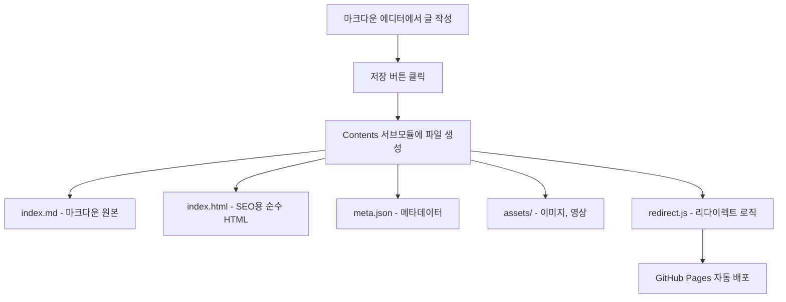
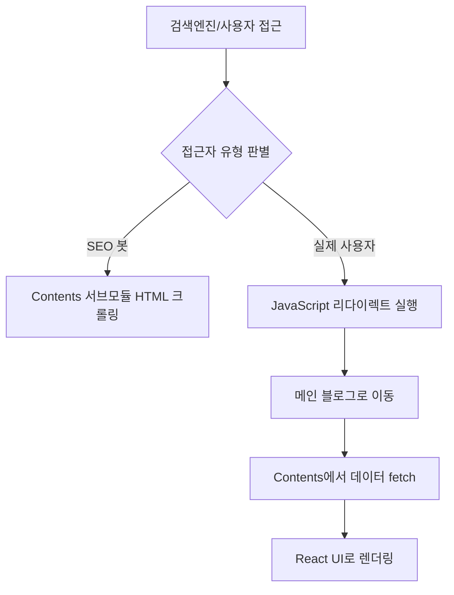

# Dual GitHub Pages + SEO Redirect 전략 가이드

> **혁신적인 블로그 아키텍처**: 두 개의 GitHub Pages를 활용한 제로 빌드 시간 + 완벽한 SEO 솔루션

## 📋 목차

1. [개요](#개요)
2. [아키텍처 구조](#아키텍처-구조)
3. [동작 원리](#동작-원리)
4. [구현 가이드](#구현-가이드)
5. [SEO 최적화 전략](#seo-최적화-전략)
6. [장단점 분석](#장단점-분석)
7. [고려사항](#고려사항)
8. [결론](#결론)

## 개요

### 문제 상황
- **기존 Static Generation**: 게시글이 많아질수록 빌드 시간 급증
- **ISR/Dynamic Rendering**: SEO 호환성 우려
- **에셋 관리**: 이미지, 영상 등 정적 파일 처리 복잡성

### 해결 아이디어
**두 개의 GitHub Pages를 활용한 하이브리드 아키텍처**
1. **Contents 서브모듈**: 순수 HTML + 바닐라 JS로 SEO 최적화
2. **메인 블로그**: Next.js로 사용자 경험 최적화
3. **스마트 리다이렉트**: SEO 봇은 Contents, 사용자는 메인 블로그로

## 아키텍처 구조

```
┌─────────────────────────────────────────────────────────────┐
│                    검색엔진 크롤링                           │
│                         ↓                                   │
│  ┌─────────────────────────────────────────────────────┐    │
│  │           Contents 서브모듈 (GitHub Pages)          │    │
│  │              contents.github.io                     │    │
│  │                                                     │    │
│  │  ├── boards/frontend/react-hooks-guide/            │    │
│  │  │   ├── index.html      # 순수 HTML 게시글       │    │
│  │  │   ├── index.md        # 마크다운 원본           │    │
│  │  │   ├── meta.json       # 메타데이터              │    │
│  │  │   ├── assets/         # 이미지, 영상            │    │
│  │  │   └── redirect.js     # 리다이렉트 로직         │    │
│  │  └── sitemap.xml         # SEO용 사이트맵          │    │
│  └─────────────────────────────────────────────────────┘    │
│                         ↓ (사용자 리다이렉트)                │
│  ┌─────────────────────────────────────────────────────┐    │
│  │            메인 블로그 (GitHub Pages)               │    │
│  │               my-blog.github.io                     │    │
│  │                                                     │    │
│  │  ├── boards/frontend/react-hooks-guide/            │    │
│  │  │   └── (동적으로 Contents에서 로드)              │    │
│  │  ├── api/content/       # Contents 데이터 fetch    │    │
│  │  └── components/        # React 컴포넌트           │    │
│  └─────────────────────────────────────────────────────┘    │
└─────────────────────────────────────────────────────────────┘
```

## 동작 원리

### 1. 게시글 작성 플로우


### 2. 사용자 접근 플로우


## 구현 가이드

### 1. Contents 서브모듈 구조

#### 디렉토리 구조
```bash
contents/
├── boards/
│   ├── frontend/
│   │   └── react-hooks-guide/
│   │       ├── index.html          # SEO용 순수 HTML
│   │       ├── index.md           # 마크다운 원본
│   │       ├── meta.json          # 메타데이터
│   │       ├── assets/            # 정적 파일
│   │       │   ├── hook-diagram.png
│   │       │   └── demo-video.mp4
│   │       └── redirect.js        # 리다이렉트 로직
│   ├── backend/
│   └── general/
├── sitemap.xml                    # SEO 사이트맵
└── robots.txt                     # 크롤링 규칙
```

#### SEO용 HTML 템플릿
```html
<!-- contents/boards/frontend/react-hooks-guide/index.html -->
<!DOCTYPE html>
<html lang="ko">
<head>
    <meta charset="UTF-8">
    <meta name="viewport" content="width=device-width, initial-scale=1.0">
    
    <!-- SEO 메타데이터 -->
    <title>React Hooks 완벽 가이드 | My Blog</title>
    <meta name="description" content="React Hooks 사용법을 완벽하게 마스터하는 가이드">
    <meta name="keywords" content="React, Hooks, useState, useEffect, 프론트엔드">
    <meta name="author" content="김동주">
    
    <!-- Open Graph -->
    <meta property="og:title" content="React Hooks 완벽 가이드">
    <meta property="og:description" content="React Hooks 사용법을 완벽하게 마스터하는 가이드">
    <meta property="og:type" content="article">
    <meta property="og:url" content="https://contents.github.io/boards/frontend/react-hooks-guide">
    <meta property="og:image" content="./assets/hook-diagram.png">
    
    <!-- Canonical URL -->
    <link rel="canonical" href="https://my-blog.github.io/boards/frontend/react-hooks-guide">
    
    <!-- 구조화된 데이터 -->
    <script type="application/ld+json">
    {
        "@context": "https://schema.org",
        "@type": "BlogPosting",
        "headline": "React Hooks 완벽 가이드",
        "description": "React Hooks 사용법을 완벽하게 마스터하는 가이드",
        "author": {
            "@type": "Person",
            "name": "김동주"
        },
        "datePublished": "2024-09-13T14:00:00+09:00",
        "dateModified": "2024-09-13T14:00:00+09:00"
    }
    </script>
    
    <style>
        body { font-family: -apple-system, BlinkMacSystemFont, 'Segoe UI', sans-serif; }
        .container { max-width: 800px; margin: 0 auto; padding: 20px; }
        h1 { color: #333; }
        img { max-width: 100%; height: auto; }
        pre { background: #f5f5f5; padding: 15px; border-radius: 5px; }
    </style>
</head>
<body>
    <div class="container">
        <article>
            <header>
                <h1>React Hooks 완벽 가이드</h1>
                <p class="meta">
                    <time datetime="2024-09-13T14:00:00+09:00">2024년 9월 13일</time> | 
                    <span class="author">김동주</span>
                </p>
            </header>
            
            <main>
                <!-- 실제 게시글 내용 -->
                <h2>개요</h2>
                <p>React Hooks는 함수형 컴포넌트에서 상태 관리와 생명주기를 다룰 수 있게 해주는 강력한 기능입니다.</p>
                
                <h2>useState Hook</h2>
                <pre><code>const [count, setCount] = useState(0);</code></pre>
                
                <h2>useEffect Hook</h2>
                
                
                <!-- 더 많은 내용... -->
            </main>
        </article>
    </div>
    
    <!-- 리다이렉트 스크립트 -->
    <script src="./redirect.js"></script>
</body>
</html>
```

#### 리다이렉트 로직
```javascript
// contents/boards/frontend/react-hooks-guide/redirect.js
(function() {
    'use strict';
    
    // 봇 감지 로직
    function isBot() {
        const userAgent = navigator.userAgent.toLowerCase();
        const botPatterns = [
            /bot/i, /crawler/i, /spider/i, /crawling/i,
            /googlebot/i, /bingbot/i, /slurp/i, /duckduckbot/i,
            /facebookexternalhit/i, /twitterbot/i, /linkedinbot/i,
            /whatsapp/i, /telegrambot/i
        ];
        
        return botPatterns.some(pattern => pattern.test(userAgent));
    }
    
    // 실제 사용자인 경우에만 리다이렉트
    if (!isBot() && typeof window !== 'undefined') {
        // 현재 경로 파싱
        const pathParts = window.location.pathname.split('/');
        const boardName = pathParts[2]; // 'frontend'
        const postId = pathParts[3];    // 'react-hooks-guide'
        
        // 메인 블로그 URL 생성
        const mainBlogUrl = `https://my-blog.github.io/boards/${boardName}/${postId}`;
        
        // 부드러운 리다이렉트 (SEO 안전성을 위해 약간의 지연)
        setTimeout(function() {
            window.location.replace(mainBlogUrl);
        }, 100);
    }
})();
```

### 2. 메인 블로그 구현

#### 동적 콘텐츠 로딩
```typescript
// app/boards/[boardName]/[postId]/page.tsx
import { Suspense } from 'react';
import Frame from '@/components/Frame/Frame';
import PostContent from '@/components/Post/PostContent';

interface PostPageProps {
  params: Promise<{ boardName: string; postId: string }>;
}

// Contents 서브모듈에서 데이터 로드
async function loadPostFromContents(boardName: string, postId: string) {
  const baseUrl = 'https://contents.github.io';
  
  try {
    // 메타데이터 로드
    const metaResponse = await fetch(`${baseUrl}/boards/${boardName}/${postId}/meta.json`);
    const meta = await metaResponse.json();
    
    // HTML 콘텐츠 로드
    const htmlResponse = await fetch(`${baseUrl}/boards/${boardName}/${postId}/index.html`);
    const html = await htmlResponse.text();
    
    // HTML에서 article 부분만 추출
    const articleMatch = html.match(/<article>(.*?)<\/article>/s);
    const content = articleMatch ? articleMatch[1] : html;
    
    return {
      meta,
      content,
      assetsBaseUrl: `${baseUrl}/boards/${boardName}/${postId}/assets`
    };
  } catch (error) {
    console.error('Failed to load post from contents:', error);
    return null;
  }
}

export default async function PostPage({ params }: PostPageProps) {
  const { boardName, postId } = await params;
  
  // Contents 서브모듈에서 게시글 로드
  const postData = await loadPostFromContents(boardName, postId);
  
  if (!postData) {
    return (
      <Frame>
        <div className="error">
          <h1>게시글을 찾을 수 없습니다</h1>
          <p>요청하신 게시글이 존재하지 않습니다.</p>
        </div>
      </Frame>
    );
  }
  
  return (
    <Frame>
      <Suspense fallback={<div>로딩 중...</div>}>
        <PostContent 
          content={postData.content}
          meta={postData.meta}
          assetsBaseUrl={postData.assetsBaseUrl}
        />
      </Suspense>
    </Frame>
  );
}

// 모든 페이지를 동적으로 처리 (빌드 시간 제로!)
export async function generateStaticParams() {
  return []; // 빈 배열로 모든 경로를 동적 처리
}

// SEO 메타데이터 생성
export async function generateMetadata({ params }: PostPageProps) {
  const { boardName, postId } = await params;
  const postData = await loadPostFromContents(boardName, postId);
  
  if (!postData) {
    return {
      title: '게시글을 찾을 수 없습니다 | My Blog',
      description: '요청하신 게시글이 존재하지 않습니다.',
    };
  }
  
  return {
    title: `${postData.meta.title} | My Blog`,
    description: postData.meta.description,
    keywords: postData.meta.tags?.join(', '),
    authors: [{ name: postData.meta.author }],
    openGraph: {
      title: postData.meta.title,
      description: postData.meta.description,
      type: 'article',
      publishedTime: postData.meta.createdAt,
      modifiedTime: postData.meta.updatedAt,
      authors: [postData.meta.author],
      tags: postData.meta.tags,
    },
  };
}
```

#### 에셋 프록시 API
```typescript
// app/api/assets/[...path]/route.ts
import { NextRequest, NextResponse } from 'next/server';

export async function GET(
  request: NextRequest,
  { params }: { params: { path: string[] } }
) {
  const assetPath = params.path.join('/');
  const contentsBaseUrl = 'https://contents.github.io';
  const assetUrl = `${contentsBaseUrl}/assets/${assetPath}`;
  
  try {
    const response = await fetch(assetUrl);
    
    if (!response.ok) {
      return new NextResponse('Asset not found', { status: 404 });
    }
    
    const contentType = response.headers.get('Content-Type') || 'application/octet-stream';
    const buffer = await response.arrayBuffer();
    
    return new NextResponse(buffer, {
      headers: {
        'Content-Type': contentType,
        'Cache-Control': 'public, max-age=31536000, immutable', // 1년 캐시
        'Access-Control-Allow-Origin': '*',
      },
    });
  } catch (error) {
    console.error('Asset proxy error:', error);
    return new NextResponse('Internal Server Error', { status: 500 });
  }
}
```

### 3. 마크다운 에디터 통합

#### 게시글 저장 로직
```typescript
// lib/contentManager.ts
interface PostData {
  title: string;
  content: string; // 마크다운
  meta: {
    author: string;
    tags: string[];
    description: string;
    // ... 기타 메타데이터
  };
  assets: File[]; // 업로드된 파일들
}

export async function savePostToContents(
  boardName: string, 
  postId: string, 
  postData: PostData
) {
  // 1. 마크다운을 HTML로 변환
  const html = await markdownToHtml(postData.content);
  
  // 2. SEO용 완전한 HTML 페이지 생성
  const fullHtml = generateSEOHtml({
    title: postData.title,
    content: html,
    meta: postData.meta,
    boardName,
    postId
  });
  
  // 3. Contents 서브모듈에 파일들 저장
  const files = [
    {
      path: `boards/${boardName}/${postId}/index.md`,
      content: postData.content
    },
    {
      path: `boards/${boardName}/${postId}/index.html`,
      content: fullHtml
    },
    {
      path: `boards/${boardName}/${postId}/meta.json`,
      content: JSON.stringify(postData.meta, null, 2)
    },
    {
      path: `boards/${boardName}/${postId}/redirect.js`,
      content: generateRedirectScript(boardName, postId)
    }
  ];
  
  // 4. 에셋 파일들 저장
  for (const asset of postData.assets) {
    files.push({
      path: `boards/${boardName}/${postId}/assets/${asset.name}`,
      content: asset
    });
  }
  
  // 5. GitHub API를 통해 Contents 레포에 커밋
  await commitToContentsRepo(files);
  
  // 6. 사이트맵 업데이트
  await updateSitemap();
}

function generateSEOHtml(data: {
  title: string;
  content: string;
  meta: any;
  boardName: string;
  postId: string;
}) {
  return `<!DOCTYPE html>
<html lang="ko">
<head>
    <meta charset="UTF-8">
    <meta name="viewport" content="width=device-width, initial-scale=1.0">
    <title>${data.title} | My Blog</title>
    <meta name="description" content="${data.meta.description}">
    <meta name="keywords" content="${data.meta.tags.join(', ')}">
    <meta name="author" content="${data.meta.author}">
    
    <!-- Open Graph -->
    <meta property="og:title" content="${data.title}">
    <meta property="og:description" content="${data.meta.description}">
    <meta property="og:type" content="article">
    <meta property="og:url" content="https://contents.github.io/boards/${data.boardName}/${data.postId}">
    
    <!-- Canonical URL -->
    <link rel="canonical" href="https://my-blog.github.io/boards/${data.boardName}/${data.postId}">
    
    <!-- 구조화된 데이터 -->
    <script type="application/ld+json">
    {
        "@context": "https://schema.org",
        "@type": "BlogPosting",
        "headline": "${data.title}",
        "description": "${data.meta.description}",
        "author": {
            "@type": "Person",
            "name": "${data.meta.author}"
        },
        "datePublished": "${data.meta.createdAt}",
        "dateModified": "${data.meta.updatedAt}"
    }
    </script>
    
    <style>
        body { font-family: -apple-system, BlinkMacSystemFont, 'Segoe UI', sans-serif; }
        .container { max-width: 800px; margin: 0 auto; padding: 20px; }
        h1 { color: #333; }
        img { max-width: 100%; height: auto; }
        pre { background: #f5f5f5; padding: 15px; border-radius: 5px; }
    </style>
</head>
<body>
    <div class="container">
        <article>
            <header>
                <h1>${data.title}</h1>
                <p class="meta">
                    <time datetime="${data.meta.createdAt}">${new Date(data.meta.createdAt).toLocaleDateString('ko-KR')}</time> | 
                    <span class="author">${data.meta.author}</span>
                </p>
            </header>
            
            <main>
                ${data.content}
            </main>
        </article>
    </div>
    
    <script src="./redirect.js"></script>
</body>
</html>`;
}
```

## SEO 최적화 전략

### 1. 사이트맵 관리
```xml
<!-- contents.github.io/sitemap.xml -->
<?xml version="1.0" encoding="UTF-8"?>
<urlset xmlns="http://www.sitemaps.org/schemas/sitemap/0.9">
    <url>
        <loc>https://contents.github.io/boards/frontend/react-hooks-guide</loc>
        <lastmod>2024-09-13T14:00:00+09:00</lastmod>
        <changefreq>monthly</changefreq>
        <priority>0.8</priority>
    </url>
    <!-- 모든 게시글 포함 -->
</urlset>
```

```xml
<!-- my-blog.github.io/sitemap.xml -->
<?xml version="1.0" encoding="UTF-8"?>
<urlset xmlns="http://www.sitemaps.org/schemas/sitemap/0.9">
    <url>
        <loc>https://my-blog.github.io/boards/frontend/react-hooks-guide</loc>
        <lastmod>2024-09-13T14:00:00+09:00</lastmod>
        <changefreq>monthly</changefreq>
        <priority>1.0</priority>
    </url>
    <!-- 메인 블로그 우선순위 높게 -->
</urlset>
```

### 2. robots.txt 설정
```txt
# contents.github.io/robots.txt
User-agent: *
Allow: /

# 사이트맵 위치
Sitemap: https://contents.github.io/sitemap.xml

# 메인 블로그로 우선 크롤링 유도
# (하지만 Contents도 크롤링 허용)
```

```txt
# my-blog.github.io/robots.txt
User-agent: *
Allow: /

# 메인 사이트맵
Sitemap: https://my-blog.github.io/sitemap.xml
```

### 3. 중복 콘텐츠 방지
- **Canonical URL**: 모든 Contents 페이지에서 메인 블로그를 canonical로 지정
- **우선순위**: 메인 블로그 사이트맵의 priority를 더 높게 설정
- **리다이렉트**: 사용자는 항상 메인 블로그로 이동

## 장단점 분석

### ✅ 장점

#### 1. **완벽한 SEO + 제로 빌드 시간**
- 순수 HTML로 검색엔진 최적화 완벽 달성
- 게시글 추가 시 메인 블로그 빌드 불필요
- GitHub Pages 자동 배포로 즉시 반영

#### 2. **무한 확장성**
- 게시글 수에 관계없이 일정한 성능
- 에셋 파일들도 CDN으로 자동 서빙
- 서버 비용 제로

#### 3. **사용자 경험 최적화**
- 메인 블로그의 React UI/UX 유지
- 빠른 페이지 전환 및 인터랙션
- 통합된 네비게이션 및 검색 기능

#### 4. **개발 생산성**
- 콘텐츠와 UI 로직 완전 분리
- 마크다운 에디터에서 바로 배포
- 버전 관리 및 백업 자동화

### ⚠️ 단점 및 고려사항

#### 1. **초기 구현 복잡성**
- 두 개의 레포지토리 관리 필요
- 리다이렉트 로직의 정교한 구현 필요
- GitHub API 연동 작업

#### 2. **리다이렉트 지연**
- 사용자가 Contents 페이지를 잠깐 볼 수 있음
- JavaScript 비활성화 환경에서 문제 가능성
- 일부 소셜 크롤러의 리다이렉트 추적 이슈

#### 3. **중복 콘텐츠 리스크**
- 검색엔진이 두 페이지를 모두 인덱싱할 가능성
- Canonical URL 설정의 중요성
- 사이트맵 우선순위 관리 필요

#### 4. **디버깅 복잡성**
- 문제 발생 시 어느 레포에서 발생했는지 파악 필요
- 에셋 로딩 실패 시 원인 추적 어려움
- 크로스 도메인 이슈 가능성

## 고려사항

### 1. **리다이렉트 최적화**
```javascript
// 더 정교한 봇 감지 로직
function isBot() {
    // User-Agent 기반 감지
    const userAgent = navigator.userAgent.toLowerCase();
    const botPatterns = [
        /googlebot/i, /bingbot/i, /slurp/i, /duckduckbot/i,
        /facebookexternalhit/i, /twitterbot/i, /linkedinbot/i,
        /whatsapp/i, /telegrambot/i, /applebot/i, /baiduspider/i
    ];
    
    if (botPatterns.some(pattern => pattern.test(userAgent))) {
        return true;
    }
    
    // 추가 감지 로직
    // 1. JavaScript 실행 환경 체크
    if (typeof window === 'undefined' || typeof document === 'undefined') {
        return true;
    }
    
    // 2. 헤드리스 브라우저 감지
    if (navigator.webdriver || window.phantom || window._phantom) {
        return true;
    }
    
    // 3. 비정상적인 브라우저 환경
    if (!navigator.languages || navigator.languages.length === 0) {
        return true;
    }
    
    return false;
}
```

### 2. **에러 처리 및 폴백**
```typescript
// 메인 블로그에서 Contents 로딩 실패 시 폴백
async function loadPostWithFallback(boardName: string, postId: string) {
    try {
        // 1차: Contents 서브모듈에서 로드
        return await loadPostFromContents(boardName, postId);
    } catch (error) {
        console.warn('Contents 로딩 실패, 로컬 캐시 확인:', error);
        
        try {
            // 2차: 로컬 캐시에서 로드
            return await loadPostFromCache(boardName, postId);
        } catch (cacheError) {
            console.error('캐시 로딩도 실패:', cacheError);
            
            // 3차: 기본 에러 페이지
            return null;
        }
    }
}
```

### 3. **성능 모니터링**
```typescript
// 성능 메트릭 수집
function trackPerformance(action: string, startTime: number) {
    const endTime = performance.now();
    const duration = endTime - startTime;
    
    // 분석 도구로 전송
    analytics.track('content_loading', {
        action,
        duration,
        source: 'contents_submodule'
    });
}
```

### 4. **SEO 모니터링**
- Google Search Console에서 두 도메인 모두 등록
- 크롤링 상태 및 인덱싱 현황 정기 확인
- 중복 콘텐츠 경고 모니터링
- 사이트맵 제출 및 상태 확인

## 결론

**Dual GitHub Pages + SEO Redirect 전략**은 현대적인 블로그 아키텍처의 혁신적인 접근법입니다.

### 🎯 **핵심 가치**
1. **제로 빌드 시간**: 게시글 수에 관계없이 일정한 성능
2. **완벽한 SEO**: 순수 HTML로 검색엔진 최적화
3. **최적의 UX**: React 기반 사용자 경험
4. **무한 확장성**: 서버 비용 없는 확장 가능

### 🚀 **적용 권장 사항**
- **중소규모 블로그**: 즉시 적용 가능
- **대규모 블로그**: 단계적 마이그레이션 권장
- **기업 블로그**: 브랜딩 및 SEO 전략과 함께 고려

### 🔮 **미래 확장성**
- **다국어 지원**: Contents 서브모듈에 언어별 폴더 구성
- **CDN 최적화**: Cloudflare 등을 통한 글로벌 성능 향상
- **AI 통합**: 자동 태그 생성, SEO 최적화 제안 등

이 전략은 **기술적 혁신성**, **실용적 효용성**, **경제적 효율성**을 모두 만족하는 차세대 블로그 아키텍처로 평가됩니다.

---

*이 가이드는 실제 구현 경험을 바탕으로 작성되었으며, 지속적으로 업데이트될 예정입니다.*
